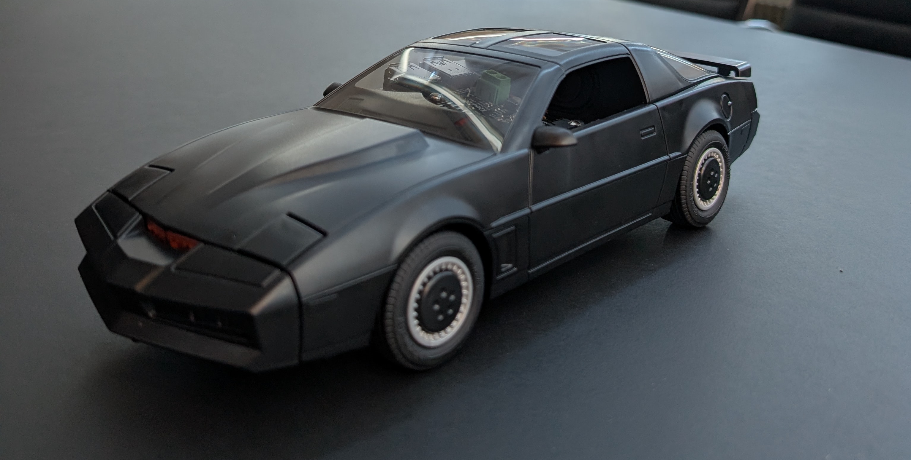
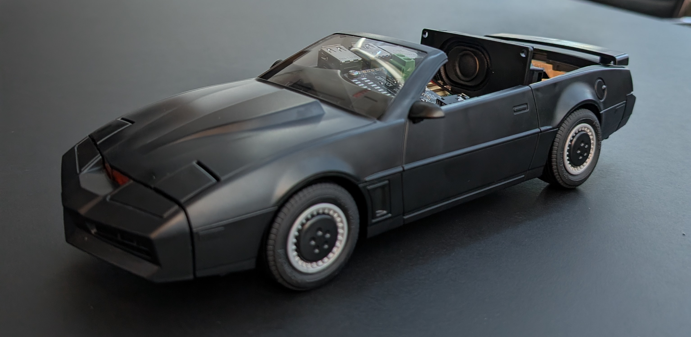

# Knight Rider

 

https://github.com/user-attachments/assets/b75bbb86-f464-45c9-bde8-097b5ae7f3d3

This is the code for a workshop that was given at RustConf 2025 in Seattle with the name "Rust at The Edge: AI Development, Edge Deployment, Real World Inference".
It provides reference code that allows you to have voice conversations with an LLM.

It uses the following AI models to achieve the result:

- SileroVAD: Detects if voice is in the input audio [(Link)](https://github.com/Sahl-AI/silero-vad)
- Moonshine STT: Converts speech into text [(Link)](https://github.com/moonshine-ai/moonshine)
- Gemma 3 270M LLM: The large language model [(Link)](https://huggingface.co/google/gemma-3-270m)
- Matcha TTS: Converts text to speech [(Link)](https://github.com/ulutsoftlls/matchaTTS)

## Prerequisites

### Hardware Prerequisites

This example was meant to run on a Raspberry Pi 5, although it should run on any other computer as well.

What you need to recreate the demo:

- Raspberry Pi 5 4 or 8GB (depending on which LLM you want to run)
- Codec HAT with Microphone and Speaker Output ([Raspberry Pi Codec Zero](https://www.raspberrypi.com/products/codec-zero/))
- Mini speakers (eg. [CQRobot Miniature Speakers](https://www.cqrobot.com/index.php?route=product/product&product_id=1465))
- SD-Card with 16 GB capacity
- Optional: [Knight Rider - K.I.T.T. Playmobil Car](https://www.playmobil.com/knight-rider---k.i.t.t./70924.html) or any other Knight Rider model where the Raspi fits inside
- Optional: Power bank, so you can carry the car around

### Software Prerequisites

- If you are using the Raspberry Pi, set up the SD card with Raspberry Pi OS Lite (64-bit) according to [this guide](https://www.raspberrypi.com/documentation/computers/getting-started.html) and make sure you allowed SSH in the Rasperry Pi Imager.

- SSH into the RPi and download this repo

```sh
sudo apt install git
git clone https://github.com/steckes/knight-rider.git ~/knight-rider
cd ~/knight-rider
```

- Install Linux dependencies and set up Raspberry Pi Codec Zero (steps taken from [this guide](https://www.raspberrypi.com/documentation/accessories/audio.html#configuration)):

```sh
sudo ./rpi-config/install.sh
sudo reboot now
```

## Build

### Download Models

Make sure you downloaded all necessary models inside of the `knight-rider` folder:

```sh
# Silero VAD
wget https://github.com/k2-fsa/sherpa-onnx/releases/download/asr-models/silero_vad.onnx
```

Choose your Speech to Text Model:

```sh
# Moonshine (Default)
wget https://github.com/k2-fsa/sherpa-onnx/releases/download/asr-models/sherpa-onnx-moonshine-tiny-en-int8.tar.bz2
tar xvf sherpa-onnx-moonshine-tiny-en-int8.tar.bz2
rm sherpa-onnx-moonshine-tiny-en-int8.tar.bz2
# or Whisper
wget https://github.com/k2-fsa/sherpa-onnx/releases/download/asr-models/sherpa-onnx-whisper-tiny.tar.bz2
tar xvf sherpa-onnx-whisper-tiny.tar.bz2
rm sherpa-onnx-whisper-tiny.tar.bz2
```

Choose your Text to Speech Model:

```sh
# Matcha(Default)
wget https://github.com/k2-fsa/sherpa-onnx/releases/download/tts-models/matcha-icefall-en_US-ljspeech.tar.bz2
wget https://github.com/k2-fsa/sherpa-onnx/releases/download/vocoder-models/hifigan_v2.onnx
tar xvf matcha-icefall-en_US-ljspeech.tar.bz2
rm matcha-icefall-en_US-ljspeech.tar.bz2
# or Kitten
wget https://github.com/k2-fsa/sherpa-onnx/releases/download/tts-models/kitten-nano-en-v0_2-fp16.tar.bz2
tar xf kitten-nano-en-v0_2-fp16.tar.bz2
rm kitten-nano-en-v0_2-fp16.tar.bz2
# or Kokoro
wget https://github.com/k2-fsa/sherpa-onnx/releases/download/tts-models/kokoro-multi-lang-v1_0.tar.bz2
tar xf kokoro-multi-lang-v1_0.tar.bz2
rm kokoro-multi-lang-v1_0.tar.bz2
```

Choose your LLM:

```sh
# Gemma 3 270M (fast, but not super smart)
wget https://huggingface.co/ggml-org/gemma-3-270m-it-GGUF/resolve/main/gemma-3-270m-it-Q8_0.gguf?download=true
# Gemma 3 1B (slow, but good quality)
wget https://huggingface.co/ggml-org/gemma-3-1b-it-GGUF/resolve/main/gemma-3-1b-it-Q4_K_M.gguf?download=true
```

### Build Llama Server

```sh
git clone https://github.com/ggml-org/llama.cpp ~/llama.cpp
cd ~/llama.cpp
cmake -B build
cmake --build build --target llama-server --config Release -j
```

## Run

### Autostart

The install script `rpi-config/install.sh` will configure `/etc/rc.local` which will automatically run the `rpi-config/start.sh` script at startup.
Modify the `rpi-config/start.sh` script if you want to load a different LLM.

### Run manually

On the Raspberry Pi just use this script to start the two processes in the background:

```sh
~/knight-rider/rpi-config/start.sh
```

To stop the background processes run:

```sh
~/knight-rider/rpi-config/stop.sh
```

If you downloaded the folders into different paths you can still run it manually:

```sh
/path/to/llama-server -m /path/to/gemma-3-270m-it-Q8_0.gguf -c 0 -fa
# in this folder run
cargo run --release
```

## Errors?

### Audio Device not detected

In case your audio device is not detected or it is not starting, set the exact input / output device name of you soundcard right at the start of the `main.rs` file.
To see the exact names of the devices you can list them by commenting out the first line in the main function (`list_device_names`).

### K.I.T.T. does not start when booting the Pi

Check the logs at `~/knight-rider/start.log` or `/var/log/rc.local.log`.
